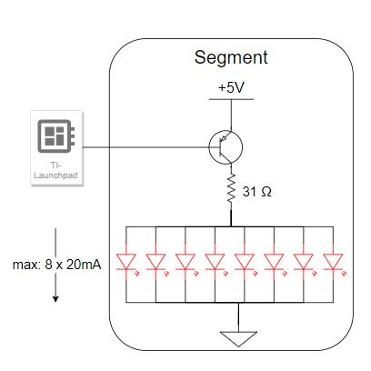

# Streets-of-Rodeo-Lap-Timer

## Description  

This project is a motion detecting lap timer with a 4 digit 7 segement display for the timer. 

The initial idea was to use a laser sensor that would trigger when we passed through. It wasn't ideal to have to place objects on both sides and possibly even have a wire tracing back over the track. I remembered using sonic distance sensors in physics class which only had 1 emitted and were suprisingly accurate. We happened to have a ultrasonic distance sensor and Launchpad lying around so we built the project around that. 

The operation of the distance sensor is slightly complicated but luckily there is plenty of code on the internet for this sensor. This is the explanation we used and base code we modified: https://create.arduino.cc/projecthub/abdularbi17/ultrasonic-sensor-hc-sr04-with-arduino-tutorial-327ff6

We modeled our custom 7 segment display off of this one we bought. It is a common anode display. This datasheet was useful: https://www.allelectronics.com/mas_assets/media/allelectronics2018/spec/FDA-5.pdf

## Display

### Circuit Diagrams
  
  

Above is the circuit diagram for a given segment. We will be running the LEDS at 20mA and controlling the segments with a PNP transistor switched by the launchpad. The 31 ohms was calculated to get the desired 20mA/LED number.

   

The 5mA current coming into the board per transistor is calculated using the hfe number provided by the transistor datasheet and this equation: I_C = (hfe) * I_B. For a PNP we are sinking current. The total current into the board is 35mA. The board must only dissapate about .175W. Note that only 1 digit is ever on at a time. The total draw of the digit from the power source is 160mA * 7 = 1.12A --at 5V--> 5.6W 
  

## Ingredients:  

- HC-SR04 Ultrasonic Distance Sensor: https://www.amazon.com/SainSmart-HC-SR04-Ranging-Detector-Distance/dp/B004U8TOE6 
- 4-Digit 7 Segement Display (Deprecated): https://www.allelectronics.com/item/fda-5/4-digit-red-clock-display-0.4-digits/1.html  
- 3-24V Beeper: https://www.allelectronics.com/item/sbz-324/3-24-vdc-beeper/1.html  
- TI Launchpad MSP-EXP430F5529LP: https://www.ti.com/tool/MSP-EXP430F5529LP
- 224 Red LEDS: https://www.allelectronics.com/item/led-513/5mm-red-led/1.html
- 28 PNP Transistors: https://www.allelectronics.com/item/2n3905/2n3905-pnp-to-92-transistor/1.html

### Spec/Datasheets:  

- Transistors: https://www.allelectronics.com/mas_assets/media/allelectronics2018/spec/LED-513.pdf
- Launchpad: https://www.ti.com/lit/ug/slau533d/slau533d.pdf?ts=1653799657399
- Sensor: https://web.eece.maine.edu/~zhu/book/lab/HC-SR04%20User%20Manual.pdf
- Display: https://www.allelectronics.com/mas_assets/media/allelectronics2018/spec/FDA-5.pdf
