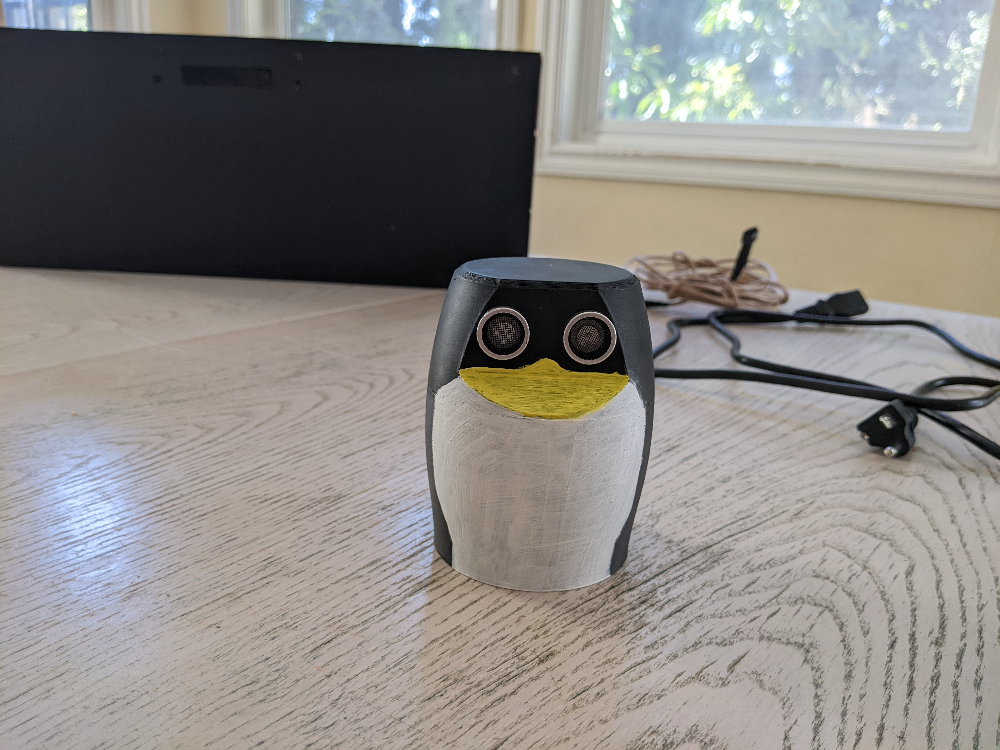
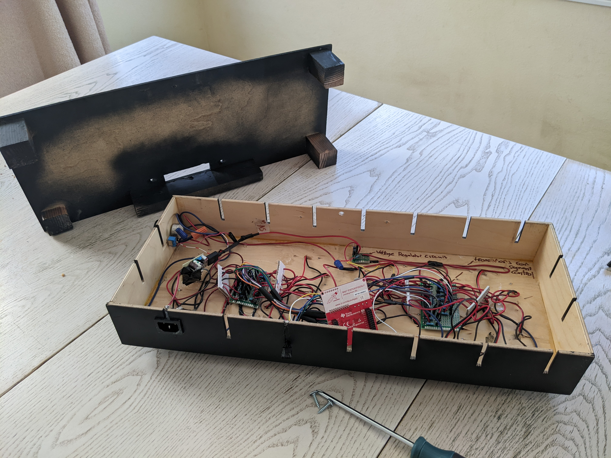

# Streets-of-Rodeo-Lap-Timer

## Project Description  

As a destressing pastime, my brother and I ride our bikes around our driveway as fast as we can. How fast? This project helps us answer that question with precision. This project is a motion detecting lap timer with a custom built 4 digit 7 segement display for the timer. It uses a ultrasonic distance sensor combined with a custom 4 digit 7 segment common anode display. Its controlled by a cheap microcontroller and designed to be powered from a wall outlet. It consisted of lots of LED, resistor, and transistor soldering, 3D printing for the LED cases, circuit design to ensure we weren't exceeding the microcontrollers limits as described on the datasheet, and C++ code writing.  
  
  
  
### High Level Design Choices: 

The initial idea was to use a laser sensor that would trigger when we passed through. It wasn't ideal to have to place objects on both sides and possibly even have a wire tracing back over the track. I remembered using sonic distance sensors in physics class which only had 1 emitter and were suprisingly accurate. We happened to have a ultrasonic distance sensor and microcontroller lying around so we built the project around that.  

The original plan was to buy a 7 segment display but the largest ones our local All Electronics had were 1"x3". We got this design working quickly but were unsatisfied because we couldn't easily see the digits during the day or far away. So we build our own display using a modified design of the one we bought. Based on our calculations, this new display drew about 1A which introduced a lot of problems with the initial design. We had to use transistors because the microcontroller couldn't provide the power needed, we needed to connect to an outside power source and provide 2 seperate voltages (1 for the board and 1 for the LEDS), and we needed to decide on the LED layout and soldering method.  

Check out an older project: https://github.com/tomtominator/UnderglowProject  

## Finished Product

### Wooden Case and Sensor Case (Penguin)

 

Display board mounded to plywood box with main power switch and brightness dimmer mounted on the right side. The box is spray painted black to match the segments for a clean and professional look. A penguin themed 3d printed case for the distance sensor, raises it to the optimal 4 inches from the ground. Universal 3 prong power female power cable and 4 prong female sensor connectors are mounted on the bottom for easy setup and swappable cables.

 

Close up of penguin theme sensor case.

View of the back cover easliy removed with the extraction of two screws on top of the case gives easy access to all components inside. 

# Circuit, Code, and Design Descriptions

## Display

We modeled our custom 7 segment display off of this one we bought. It is a common anode display. This datasheet was useful: https://www.allelectronics.com/mas_assets/media/allelectronics2018/spec/FDA-5.pdf
### Circuit Diagrams
  
  

Above is the circuit diagram for a given segment. We will be running the LEDS at 20mA and controlling the segments with a PNP transistor switched by the launchpad. The 31 ohms was calculated to get the desired 20mA/LED number.

   

The 5mA current coming into the board per transistor is calculated using the hfe number provided by the transistor datasheet and this equation: I_C = (hfe) * I_B. For a PNP we are sinking current. The total current into the board is 35mA. The board must only dissapate about .175W. Note that only 1 digit is ever on at a time. The total draw of the digit from the power source is 160mA * 7 = 1.12A --at 5V--> 5.6W  
  
  
Our 7 segment display was slightly different from the standard design to make wiring easier. However, this made the pinout quite busy:  

   

Luckily the launchpad has many i/o pins so this simplified our hardware and lighting up a sigle digit at a time could be done in the code (this single digit lighting is done to save on power and limit the current the launchpad has to sink).  
The distance sensor was connected to the launchpad as well. The whole assembly was controlled by C++ code run on the launchpad, switching all the segments and operating the distance sensor.
  
### Experimental Results

- Total segment current = 100mA - less than expected  
- Current into base of 2N3905 = 3.5mA  
- Transistor base resistance: 150 || 270 = 96 ohms  
- No need for resistors for each LED, the transistor base resistor on limits the current flow from emitter to collector  
- LEDS plenty bright at this power level, likely want to be able to reduce brightness with pot somehow

These results will give a general estimate to make sure we don't exceed any of our parts power limits. This is also a sanity check that calculations were done correctly.  

### Display Brightness

We had to use a voltage regulator to provide both 5 and a variable 3.3-2.3V from the 5V power supply. We used the LM317 variable voltage regulator with a 10K potentionmeter. This explanation video was extremely helpful: https://www.youtube.com/watch?v=IjJWWGPjc-w.  

   

# Sensor and Code

The final version of the [code on the Launchpad](https://github.com/tomtominator/Streets-of-Rodeo-Lap-Timer/blob/main/LaunchPad%20Code/Lap_Time_Display_Custom_Final/Lap_Time_Display_Custom_Final.ino). The microcontroller was under-powered for the desired rapid operation of both the display and distance sensor. We worked to optimize the multitasking balance to get a solid display with rapid sensing for accurate lap times. Within the limitations of our materials I am satisfied but we have future plans to have 2 slow microcontrollers each doing one task and communicating (perhaps over wifi with the ardunio W). 

The operation of the distance sensor is slightly complicated but luckily there is plenty of code on the internet for this sensor. This is the explanation we used and base code we modified: https://create.arduino.cc/projecthub/abdularbi17/ultrasonic-sensor-hc-sr04-with-arduino-tutorial-327ff6  

Future Improvements:  
Make main loop event driven by performing certain functions every amount of millis() difference, instead of using counters to trigger actions. (This way we actually sample every 200ms for example)  
Make one of the digits a lap counter since we don't have hundreds place precision

# Physical Parts

### STL Files Descriptions

- 1 Segment File
Includes 8 holes for each led to be inserted and soldered on the back

- Slip in Plate
Accepts 1 segment plate to slip in firmly, allowing space for soldered connections. Wires are to be routed through the center hole in the back. Other 2 holes used for mounting to final backplate.

- 1 digit linked
Not included in our final design but would save alot of time and effort. Instead of printing segments individually this file includes 7 connected with proper spacing. Recommended for printers with ABL or a very nicely leveled bed. 

### Assembly
After 8 LEDs are soldered in paralell in each segment, power wires can be routed through the slip in plate, and the segment can be firmly inserted. (If using the individual plates, each should be mounted to a backplate prior to doing this.) 

Each segment with LEDs and power wires are pressed into their plates and all wires are routed through the slip in plate and through holes drilled in the backplate. All wires are easily accesable in the backplate for later connections to transistors and board. 

Segments could be painted matt black for a cleaner look.

All switches and pots can be mounted on the backplate 

# Links

## Ingredients:  

- HC-SR04 Ultrasonic Distance Sensor: https://www.amazon.com/SainSmart-HC-SR04-Ranging-Detector-Distance/dp/B004U8TOE6 
- 4-Digit 7 Segement Display (Deprecated): https://www.allelectronics.com/item/fda-5/4-digit-red-clock-display-0.4-digits/1.html  
- TI Launchpad MSP-EXP430F5529LP: https://www.ti.com/tool/MSP-EXP430F5529LP
- 232 Red LEDS: https://www.allelectronics.com/item/led-513/5mm-red-led/1.html
- 30 PNP Transistors: https://www.allelectronics.com/item/2n3905/2n3905-pnp-to-92-transistor/1.html
- LM317 Voltage Regulator
- Switch, 10K pot, lots of resistors(mostly 270ohm)

### Spec/Datasheets:  

- Transistors: https://www.mouser.com/datasheet/2/308/FairchildSemiconductor_16142055386277-1191860.pdf
- LEDS: https://www.allelectronics.com/mas_assets/media/allelectronics2018/spec/LED-513.pdf
- Launchpad: https://www.ti.com/lit/ug/slau533d/slau533d.pdf?ts=1653799657399
- Sensor: https://web.eece.maine.edu/~zhu/book/lab/HC-SR04%20User%20Manual.pdf
- Display: https://www.allelectronics.com/mas_assets/media/allelectronics2018/spec/FDA-5.pdf
- Voltage Regulator: https://www.ti.com/document-viewer/LM317A/datasheet/features-snvsac20075#SNVSAC20075

Daniel and Thomas Matthew 2022
